# Flujo de Datos: Conector de Base de Datos Externa

Documentación del ciclo de vida completo de los datos cuando un usuario conecta una base de datos de terceros a Lúmina.

---

## 1. Vista General del Flujo

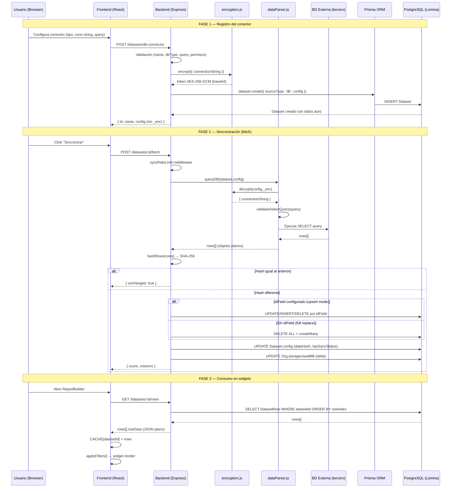

---

## 2. Fase 1: Registro del Conector

### 2.1 Endpoint

```
POST /datasets/db-connector
```

**Archivo:** `apps/backend/src/routes/datasets.js:352`

### 2.2 Payload del request

```json
{
  "name": "Ventas Q1",
  "areaId": "clx...",
  "dbType": "mssql",
  "connectionString": "Server=10.0.1.5;Database=ERP;User Id=reader;Password=xxx",
  "query": "SELECT fecha, monto, cliente FROM ventas WHERE año = 2026",
  "slotName": "ventas-source"
}
```

### 2.3 Tipos de BD soportados

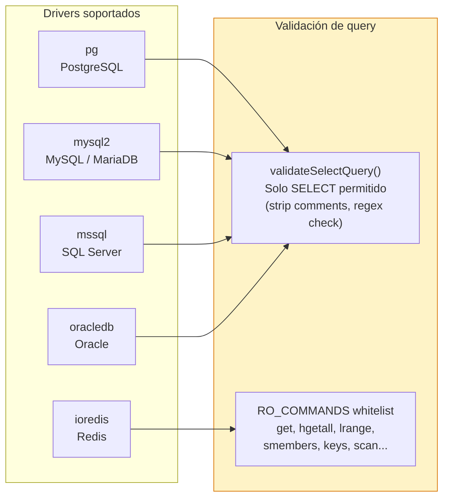

### 2.4 Encriptación de credenciales

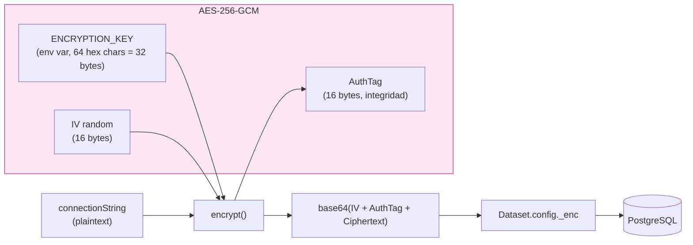

**Archivo:** `apps/backend/src/services/encryption.js`

Lo que se guarda en `Dataset.config`:

```json
{
  "dbType": "mssql",
  "query": "SELECT ...",
  "_enc": "base64(iv+tag+ciphertext)"
}
```

- `_enc` contiene `{ connectionString }` cifrado
- Nunca sale al frontend — `safeConfig()` lo stripea antes de responder
- Cada encrypt genera IV aleatorio, mismo plaintext → distinto ciphertext

### 2.5 Validaciones de seguridad

| Check | Ubicación | Detalle |
|-------|-----------|---------|
| dbType válido | `datasets.js:350` | Whitelist: `pg`, `mysql`, `mssql`, `oracle`, `redis` |
| Solo SELECT | `dataParser.js:204` | Strip comments SQL, regex `^select[\s(]` |
| Redis read-only | `dataParser.js:250` | Whitelist de ~30 comandos RO |
| Permisos de área | `datasets.js:364` | `areaMember` check o superadmin |
| Rate limit | `syncRateLimit.js` | Por plan: maxPerMinute/Hour/Day |
| Storage limit | `syncRateLimit.js:33` | `storageUsedMB >= plan.storageLimitMB` |

---

## 3. Fase 2: Sincronización de Datos

### 3.1 Trigger

```
POST /datasets/:id/fetch
```

**Archivo:** `apps/backend/src/routes/datasets.js:604`

Middleware chain: `auth → syncRateLimit → handler`

### 3.2 Resolución de credenciales

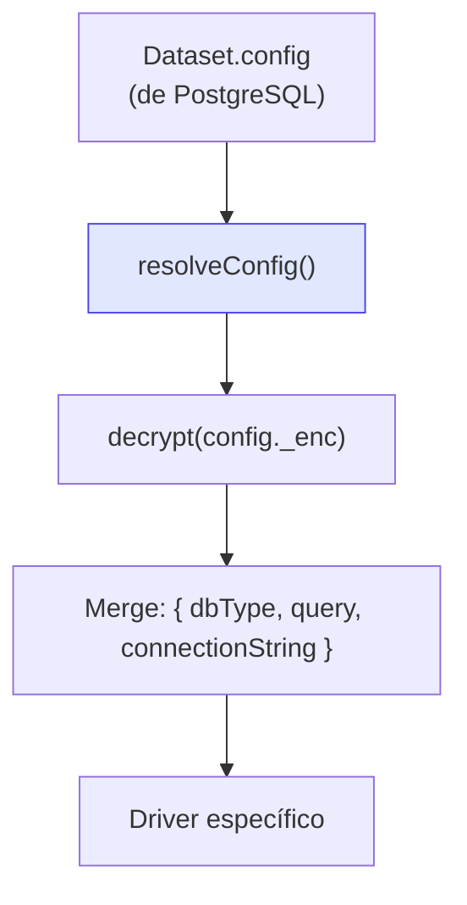

**Archivo:** `apps/backend/src/services/dataParser.js:36`

`resolveConfig()` descifra `_enc` y lo mergea con los campos públicos. Resultado: objeto con `dbType`, `connectionString`, `query` en texto plano, solo en memoria del proceso.

### 3.3 Ejecución de query por driver

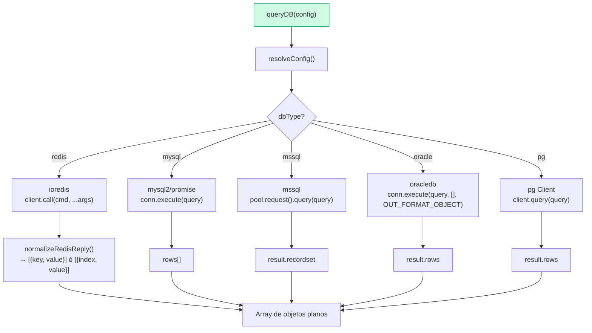

**Archivo:** `apps/backend/src/services/dataParser.js:234-318`

Cada driver:
1. Obtiene conexión del pool (PostgreSQL, MySQL, SQL Server) o abre conexión efímera (Oracle, Redis)
2. Ejecuta query
3. Retorna conexión al pool (o cierra en `finally` para efímeras)
4. Retorna array de objetos planos `[{ col1: val1, col2: val2 }, ...]`

**Connection pooling** (v0.5.0): PostgreSQL (`pg.Pool`), MySQL (`mysql2.createPool`), y SQL Server (`mssql.connect`) reutilizan conexiones. Key = `dbType + MD5(connectionString)`. Pool de 3 conexiones, TTL 10 min, cleanup automático cada 60s. Oracle y Redis mantienen conexiones efímeras.

### 3.4 Normalización de datos

Todos los drivers convergen al mismo formato de salida: **array de objetos planos**.

```
[
  { "fecha": "2026-01-15", "monto": 1500.00, "cliente": "Acme Corp" },
  { "fecha": "2026-01-16", "monto": 2300.50, "cliente": "Globex" },
  ...
]
```

Para Redis, `normalizeRedisReply()` convierte las distintas formas de respuesta:

| Comando Redis | Respuesta raw | Normalizado |
|--------------|---------------|-------------|
| `GET key` | `"value"` | `[{ value: "value" }]` |
| `HGETALL key` | `{ f1: v1, f2: v2 }` | `[{ field: "f1", value: "v1" }, ...]` |
| `LRANGE key 0 -1` | `["a", "b", "c"]` | `[{ index: 0, value: "a" }, ...]` |

### 3.5 Detección de cambios (hash)

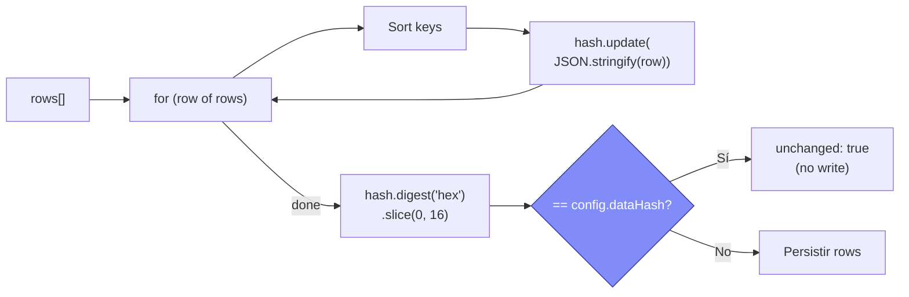

**Archivo:** `apps/backend/src/routes/datasets.js:527-534`

Hash incremental (streaming): cada row se hashea individualmente con `hash.update()`. Memoria O(1) — no serializa todo el dataset a un string. Keys se ordenan para que `{a:1, b:2}` y `{b:2, a:1}` produzcan el mismo hash. Truncado a 16 chars hex.

### 3.6 Persistencia: dos modos

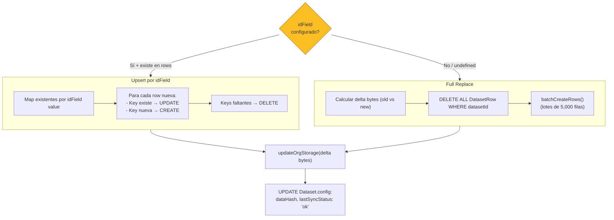

**Archivo:** `apps/backend/src/routes/datasets.js:549-601`

#### idField (campo de deduplicación)

- Configurable por el usuario tras primer sync (`PATCH /:id/id-field`)
- Si `idField = "invoice_id"`, cada row se identifica por ese campo
- Upsert: UPDATE existentes, INSERT nuevos, DELETE los que ya no vienen
- Tracking granular de storage bytes (solo deltas)

#### Full Replace (default)

- Sin idField → borra todo y re-inserta
- Inserción en lotes de 5,000 filas (`batchCreateRows()`) para evitar statements SQL masivos
- Calcula delta de bytes para ajustar `storageUsedMB`

### 3.7 Modelo de almacenamiento en PostgreSQL

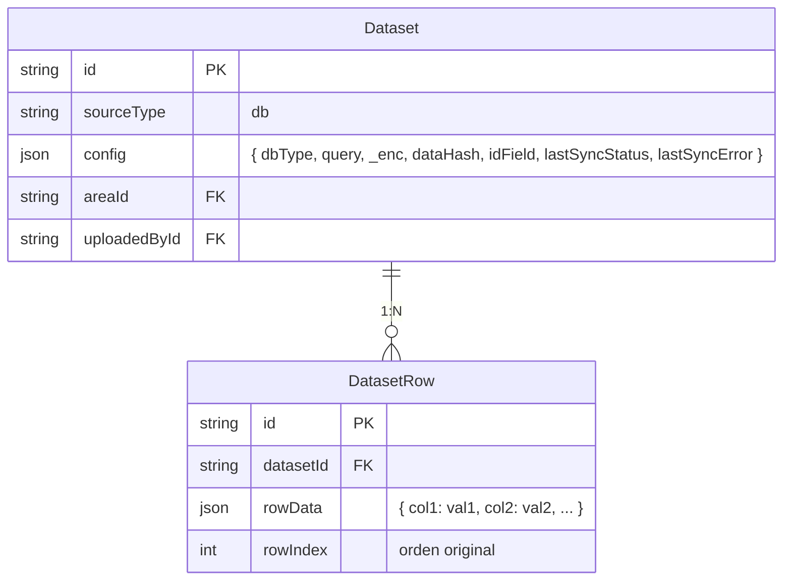

Cada fila de la BD externa se guarda como **un registro `DatasetRow`** con `rowData` = JSON del row completo. No hay schema fijo — columnas son dinámicas.

---

## 4. Fase 3: Consumo en Widgets

### 4.1 Obtención de rows

```
GET /datasets/:id/rows                    → todos los rows (backward compat)
GET /datasets/:id/rows?page=1&pageSize=1000  → paginado server-side
```

**Archivo:** `apps/backend/src/routes/datasets.js:629`

Sin parámetros, retorna `DatasetRow[].rowData` ordenado por `rowIndex` (array plano):

```json
[
  { "fecha": "2026-01-15", "monto": 1500, "cliente": "Acme" },
  { "fecha": "2026-01-16", "monto": 2300, "cliente": "Globex" }
]
```

Con paginación (`?page=1&pageSize=1000`), retorna objeto con metadata:

```json
{
  "rows": [{ "fecha": "...", "monto": 1500 }],
  "page": 1,
  "pageSize": 1000,
  "total": 85432,
  "pages": 86
}
```

`pageSize` máximo: 50,000. Default: 10,000.

### 4.2 Cache en frontend

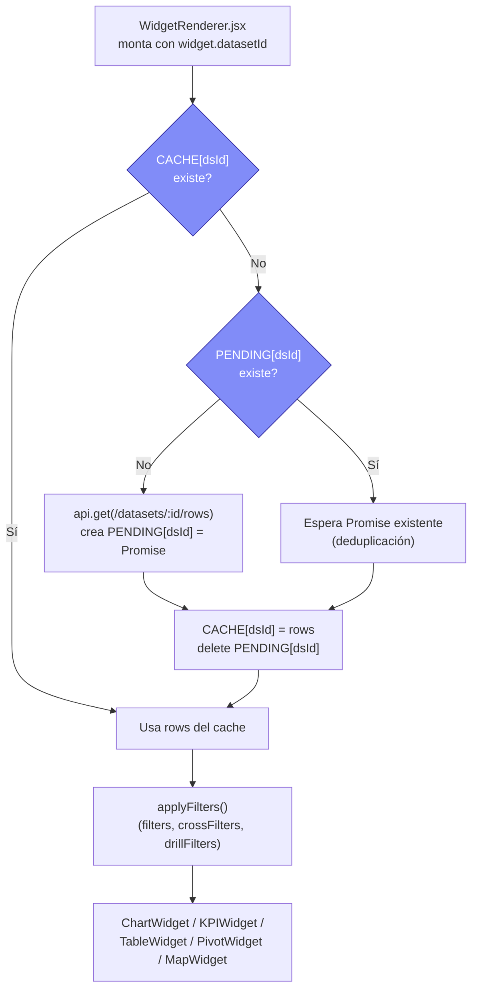

**Archivos:**
- `apps/frontend/src/components/Canvas/WidgetRenderer.jsx`
- `apps/frontend/src/lib/datasetCache.js`

Puntos clave:
- **Cache module-level** (`CACHE` object) — compartido entre todos los widgets del reporte
- **Deduplicación** — si 5 widgets usan el mismo dataset, solo 1 fetch HTTP
- **`invalidateDatasetCache(datasetId)`** — se llama después de sync para forzar refetch
- Cache vive mientras la SPA no recarga — no persiste en localStorage

### 4.3 Filtrado

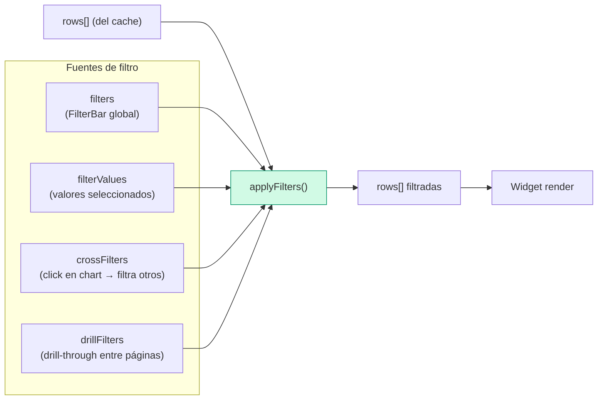

**Archivo:** `apps/frontend/src/store/reportStore.js` — función `applyFilters()`

Filtrado ocurre **100% en el frontend**, en memoria. No hay query parametrizada al backend — todos los rows se cargan y filtran client-side.

### 4.4 Rendering por tipo de widget

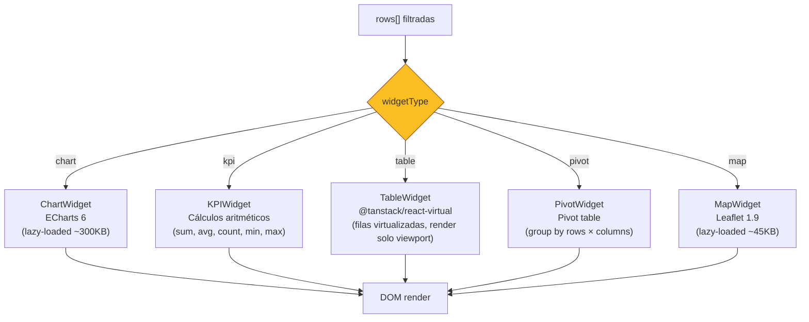

---

## 5. Sync-All (sincronización masiva)

```
POST /datasets/sync-all
```

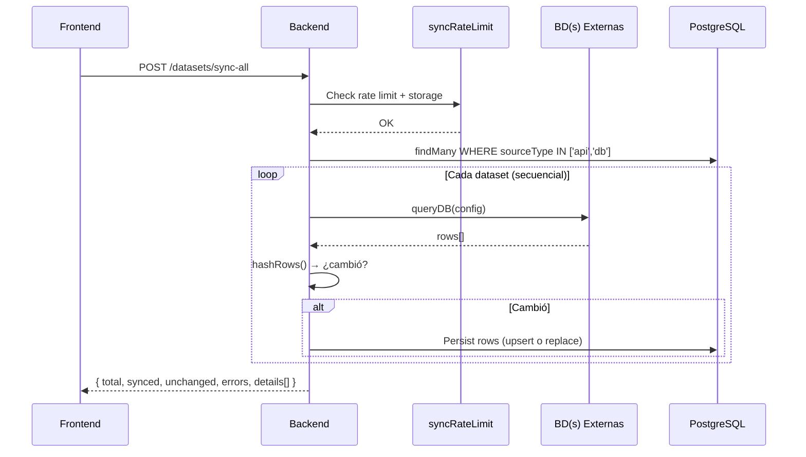

**Archivo:** `apps/backend/src/routes/datasets.js:134`

Sync-all es **secuencial** (no paralelo) — un dataset a la vez. Rate limit se aplica una sola vez al inicio.

---

## 6. Actualización del conector

```
PUT /datasets/:id/db-connector
```

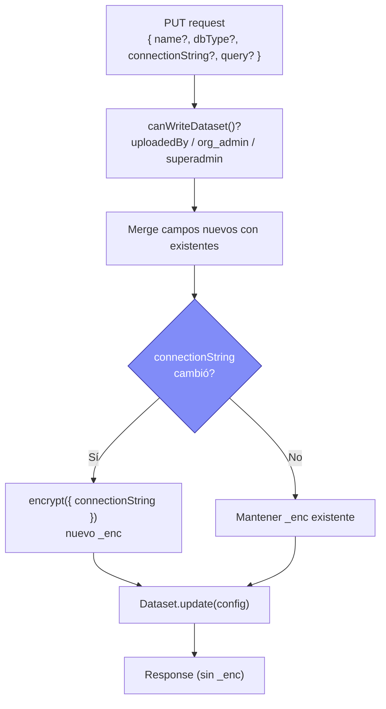

**Archivo:** `apps/backend/src/routes/datasets.js:378`

Si solo cambia la query, la connectionString cifrada se preserva intacta.

---

## 7. Manejo de errores en sync

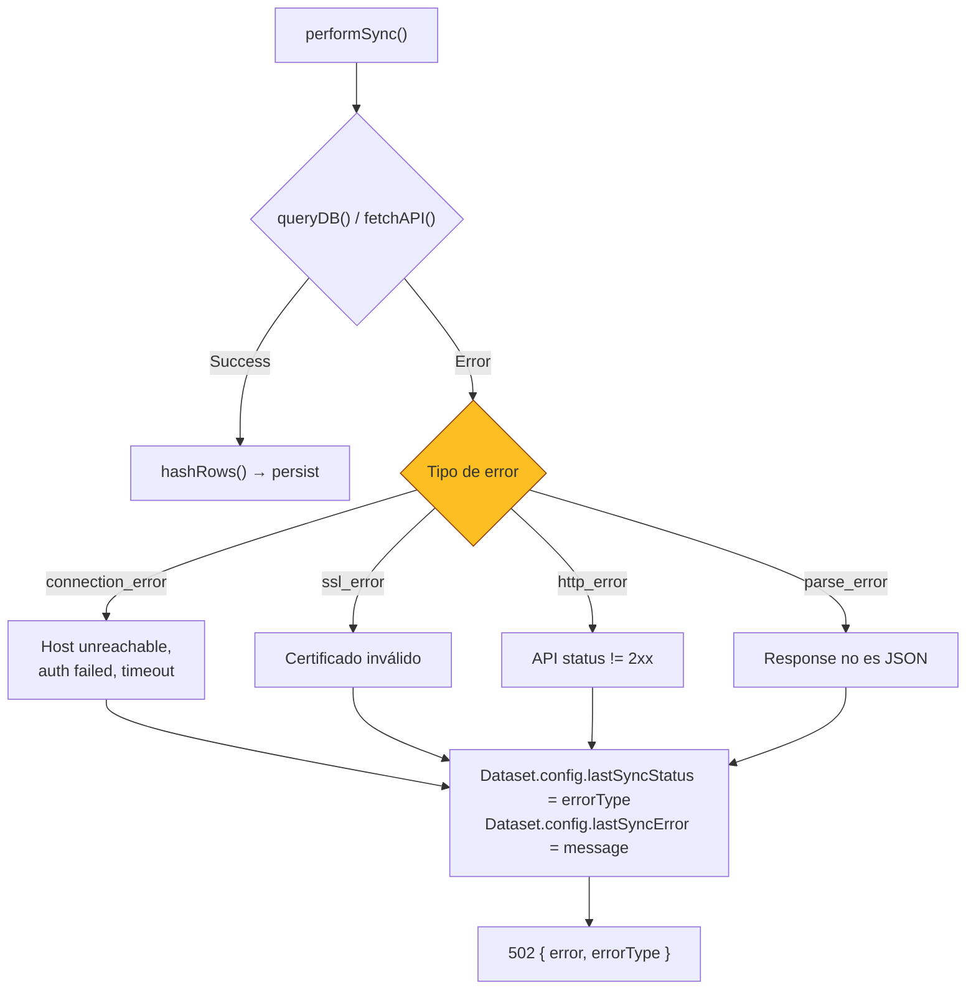

**Archivo:** `apps/backend/src/routes/datasets.js:526-540`

Errores se persisten en `config.lastSyncStatus` y `config.lastSyncError` para mostrar estado en el frontend incluso tras refrescar.

---

## 8. Tracking de Storage

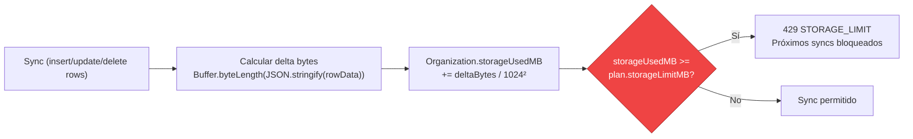

**Archivos:**
- `apps/backend/src/routes/datasets.js:44-56` — `rowBytes()`, `updateOrgStorage()`
- `apps/backend/src/middleware/syncRateLimit.js:33` — storage check

Storage se calcula por org, no por dataset. Cada sync ajusta el delta (positivo o negativo).

---

## 9. Resumen: Dónde vive cada cosa

| Dato | Dónde | Formato |
|------|-------|---------|
| Connection string | `Dataset.config._enc` | AES-256-GCM cifrado |
| Tipo de BD + query | `Dataset.config` (público) | JSON plano |
| Hash de último sync | `Dataset.config.dataHash` | 16-char hex (SHA-256 truncado) |
| Estado de sync | `Dataset.config.lastSyncStatus` | `'ok'` / `'connection_error'` / etc. |
| Campo de deduplicación | `Dataset.config.idField` | string / null / absent |
| Datos reales | `DatasetRow.rowData` | JSON plano (un row por registro) |
| Orden de filas | `DatasetRow.rowIndex` | int (0-based) |
| Consumo acumulado | `Organization.storageUsedMB` | float |
| Cache en browser | `CACHE[datasetId]` | Array in-memory (no persistido) |

---

## 10. Optimizaciones de rendimiento

### v0.4.0

| Optimización | Ubicación | Impacto |
|-------------|-----------|---------|
| **Virtualización de tabla** | `TableWidget.jsx` — `@tanstack/react-virtual` | Renderiza solo ~30 filas visibles, soporta cientos de miles sin degradar DOM |
| **Batch createMany** | `datasets.js` — `batchCreateRows()` | Inserta en lotes de 5,000 filas; evita statements SQL masivos en upload y sync |
| **Hash streaming** | `datasets.js` — `hashRows()` | `hash.update()` incremental por row; memoria O(1) en vez de O(n) |
| **Paginación server-side** | `GET /datasets/:id/rows?page=&pageSize=` | Carga parcial de rows con `skip`/`take`; max 50,000 por página |

### v0.5.0

| Optimización | Ubicación | Impacto |
|-------------|-----------|---------|
| **Agregación server-side** | `analyticsEngine.js` + `GET /aggregate` | KPI no necesita cargar todos los rows al browser; cache en memoria con TTL 5 min |
| **Bulk upsert** | `datasets.js` — `performSync()` | UPDATEs en lotes de 500 via `$transaction` en vez de 1 query secuencial por fila |
| **Connection pooling** | `dataParser.js` — pool manager | Reutiliza conexiones PG/MySQL/MSSQL (pool de 3, TTL 10 min); elimina handshake por sync |
