# Lúmina — Stack Tecnológico y Diagramas de Comunicación

## 1. Resumen del Stack

| Capa | Tecnología | Versión | Rol |
|------|-----------|---------|-----|
| **Monorepo** | pnpm workspaces | 11.x | Orquesta `apps/frontend` y `apps/backend` (`pnpm-workspace.yaml`) |
| **Dev runner** | concurrently | 9.x | Ejecuta backend + frontend en paralelo (`pnpm run dev`) |

### 1.1 Frontend (`apps/frontend/`)

| Tecnología | Versión | Rol |
|-----------|---------|-----|
| React | 19.x | UI library (lazy-loading por ruta) |
| React Router DOM | 7.x | Enrutamiento SPA (client-side) |
| Vite | 8.x | Bundler / dev server / HMR |
| Tailwind CSS | 4.x (v4, `@theme`) | Utility-first CSS con design tokens |
| Zustand | 5.x | Estado global (auth, report) |
| Axios | 1.x | Cliente HTTP con interceptores JWT |
| ECharts / echarts-for-react | 6.x / 3.x | Gráficos (bar, line, pie, scatter, etc.) |
| Leaflet / react-leaflet | 1.9 / 5.x | Mapas interactivos |
| react-grid-layout | 2.x | Grid drag-and-drop para widgets del canvas |
| @dnd-kit/core + sortable | 6.x / 10.x | Drag-and-drop genérico (ordenamiento) |
| @tanstack/react-virtual | 3.x | Virtualización de filas en TableWidget (render solo viewport) |
| nanoid | 5.x | Generación de IDs en cliente |
| ESLint | 10.x | Linting |

### 1.2 Backend (`apps/backend/`)

| Tecnología | Versión | Rol |
|-----------|---------|-----|
| Node.js + Express | 5.x | API REST |
| Prisma ORM | 5.x | ORM + migraciones |
| PostgreSQL | — | Base de datos principal |
| JSON Web Tokens (jsonwebtoken) | 9.x | Autenticación stateless |
| bcryptjs | 3.x | Hashing de contraseñas |
| Helmet | 8.x | Headers de seguridad HTTP |
| CORS | 2.x | Control de acceso cross-origin |
| Morgan | 1.x | Logging HTTP |
| Multer | 2.x | Upload de archivos (CSV, Excel) |
| csv-parse | 6.x | Parser de archivos CSV |
| exceljs + xlsx | 4.x / 0.18 | Parser de archivos Excel |
| Puppeteer | 25.x | Renderizado headless para export PDF |
| pdf-lib | 1.x | Merge de PDFs multi-página |
| otplib + qrcode | 12.x / 1.x | MFA (TOTP) con QR de setup |
| AES-256-GCM (crypto nativo) | — | Encriptación de credenciales de conectores |
| nanoid | 3.x | IDs y slugs únicos |

### 1.3 Conectores de Base de Datos (data sources externos)

| Driver | Base de datos destino |
|--------|----------------------|
| pg | PostgreSQL |
| mysql2 | MySQL / MariaDB |
| mssql | Microsoft SQL Server |
| oracledb | Oracle Database |
| ioredis | Redis |

### 1.4 Infraestructura / Dev Tools

| Herramienta | Rol |
|-------------|-----|
| pnpm | Package manager (workspaces) — reemplaza npm |
| nodemon | Hot-reload del backend en desarrollo |
| Vite dev server + proxy | Proxy reverso a Express (`:3001`) en desarrollo |
| Prisma CLI | Migraciones (`db:migrate`), generación de client (`prisma generate`) |
| ngrok (opcional) | Túnel público para testing externo |

---

## 2. Arquitectura de Alto Nivel

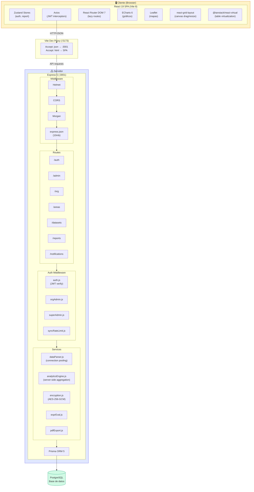

---

## 3. Flujo de Autenticación

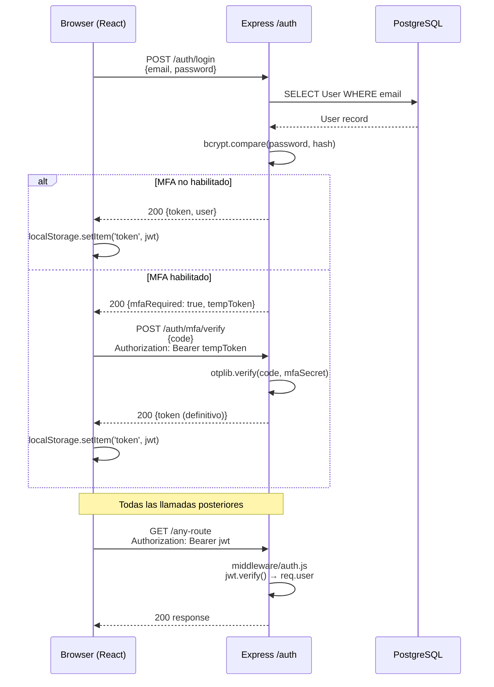

---

## 4. Flujo de Datos (Datasets)

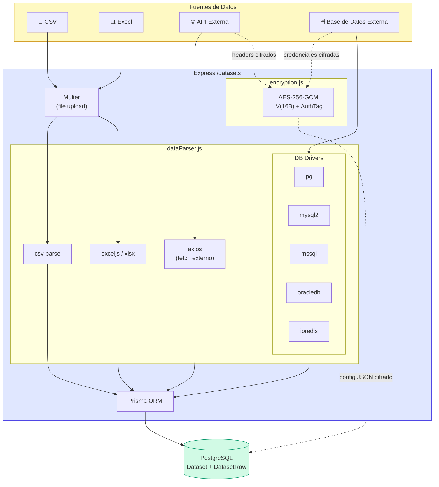

---

## 5. Flujo del Report Builder (Canvas)

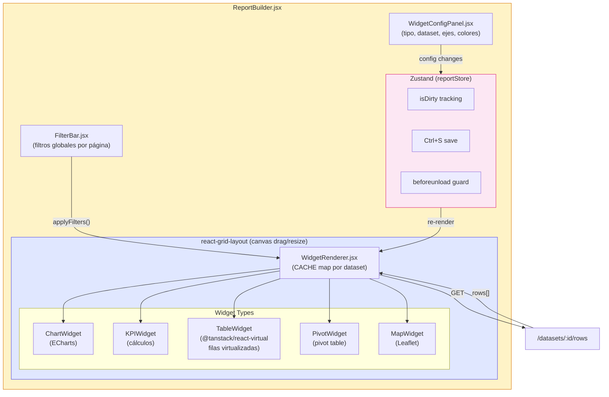

---

## 6. Export PDF

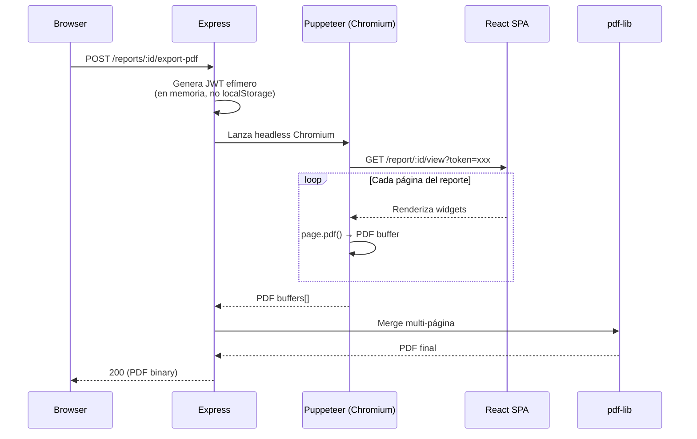

---

## 7. Modelo de Datos (Entidad-Relación)

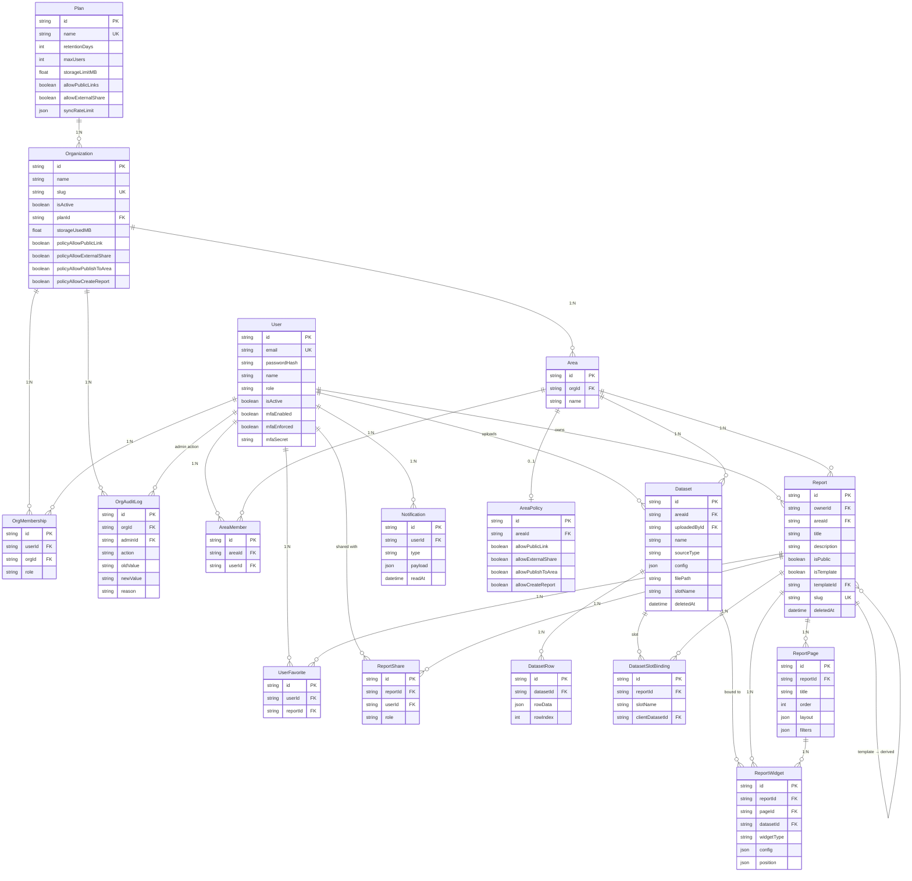

---

## 8. Rutas de la API

| Grupo | Endpoint destacados | Auth |
|-------|-------------------|------|
| `/auth` | `POST /login`, `POST /register`, `POST /mfa/setup`, `POST /mfa/verify`, `PUT /change-password` | Público (login/register), JWT (resto) |
| `/admin` | CRUD usuarios, orgs, planes, reportes de admin | JWT + superadmin |
| `/org` | CRUD org, membresías, planes, política | JWT + org_admin |
| `/areas` | CRUD áreas, miembros, políticas | JWT + org_admin |
| `/datasets` | Upload CSV/Excel, sync API/DB, CRUD, `/rows` (paginado), `/aggregate`, `/stats`, `/distinct`, `/file` | JWT |
| `/reports` | CRUD, favorites, share, export-pdf, publish slug | JWT (público para `/public/:slug`) |
| `/notifications` | GET (listar), PATCH (marcar leído) | JWT |
| `/health` | Healthcheck | Público |

---

## 9. Middleware Pipeline

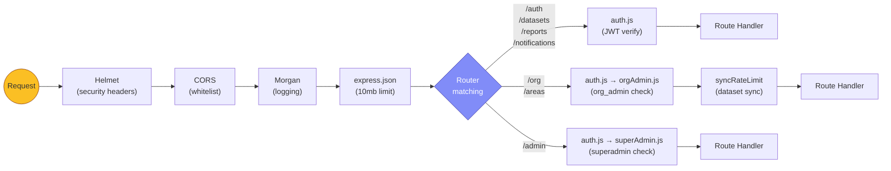

---

## 10. Frontend — Estructura de Rutas

| Ruta | Componente | Auth | Descripción |
|------|-----------|------|-------------|
| `/login` | Login | No | Login + registro |
| `/` | Dashboard | JWT | Home, reportes recientes, favoritos |
| `/report/:id` | ReportBuilder | JWT | Editor de reportes (canvas) |
| `/report/:id/view` | ReportView | Token URL | Vista read-only (usada por Puppeteer PDF) |
| `/public/:slug` | PublicReport | No | Reporte público compartido |
| `/datasets` | Datasets | JWT | Gestión de datasets |
| `/explore` | Explore | JWT | Exploración de datos |
| `/admin` | Admin | JWT + superadmin | Panel superadmin |
| `/org/admin` | OrgAdmin | JWT + org_admin | Panel admin de organización |
| `/profile` | Profile | JWT | Perfil de usuario, MFA, cambio de contraseña |
| `/changelog` | Changelog | JWT | Historial de versiones y mejoras |

---

## 11. Comunicación entre Componentes Frontend

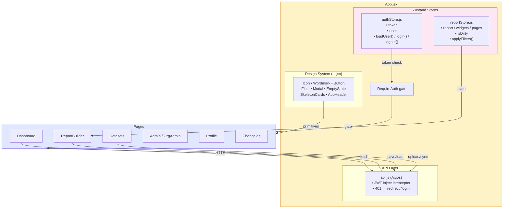

---

## 12. Seguridad

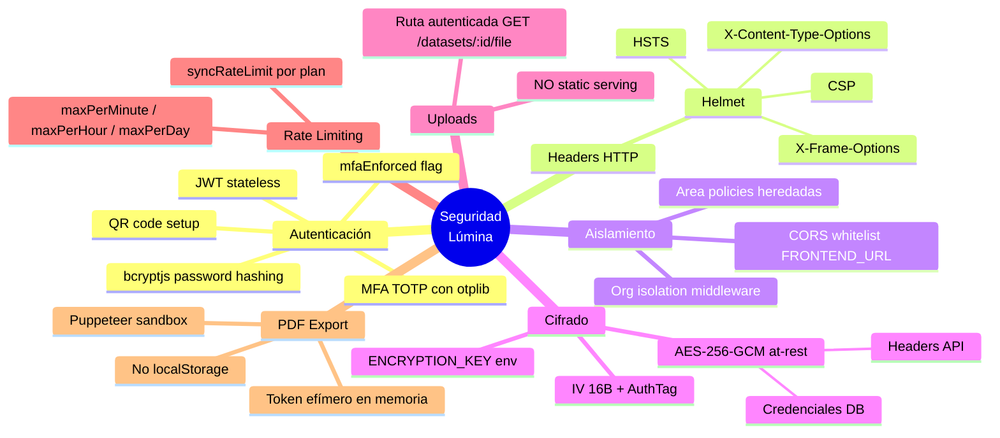

---

## 13. Design Tokens (Tailwind v4)

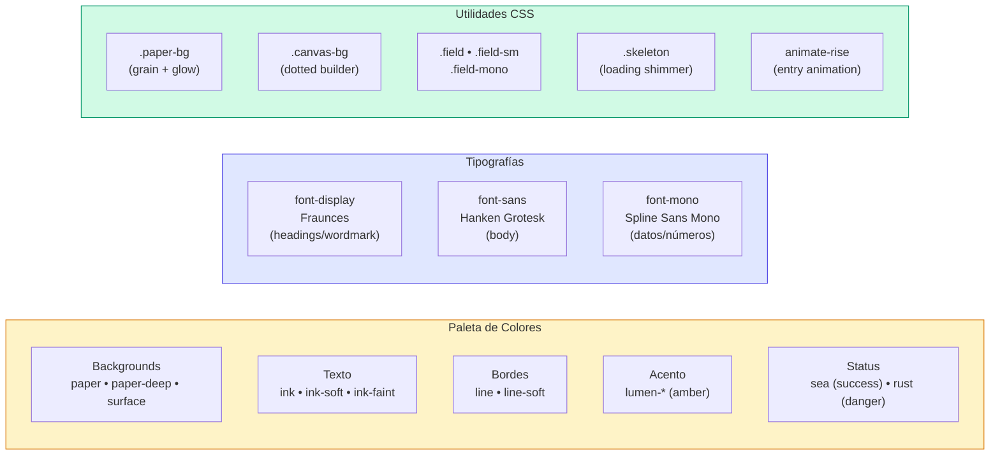

---

## 14. Diagrama de Despliegue (Desarrollo)

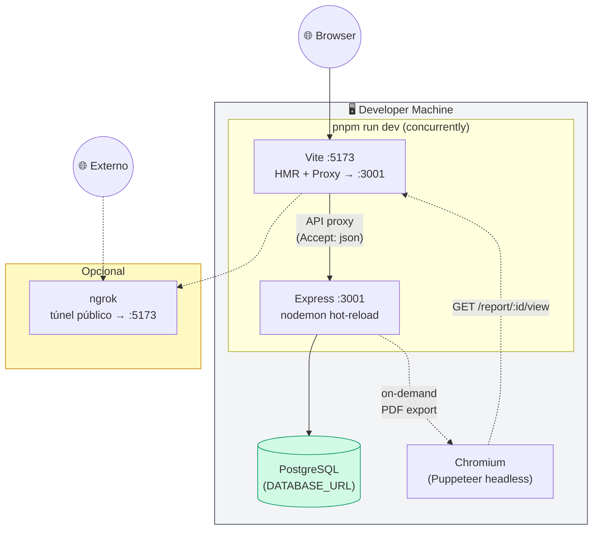

---

## 15. Flujo Completo: Request Lifecycle

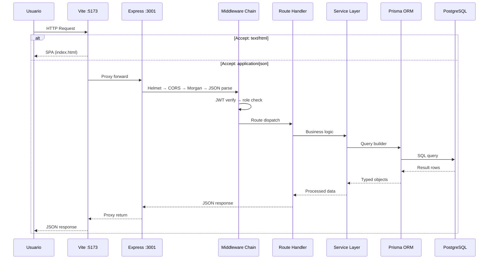
